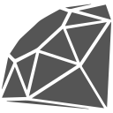

# Hello, World!

Welcome to my GitHub!

I'm a grad student working toward my M.S. in Computational Linguistics at the University of Colorado Boulder. I'm excited about everything related to NLP, but my primary interests are speech recognition, machine translation, and live agents – technologies that I hope will create engaging new ways for people to learn languages and improve their spoken confidence.

Below, you'll find several of my old personal projects, ranging from fun JaveScript toys to technical writing on NLP and computer vision. Please enjoy and let me know what you think! And, if you're interested in talking shop or seeing what I'm working on now, you can [connect with me on LinkedIn](https://www.linkedin.com/in/seanvonb/) as well.

Thanks for stopping by!

```javascript
import { SeanvonB as Me } from "https://www.linkedin.com/in/seanvonb";

class About extends Me {
	constructor(...args) {
		super(...args);
		this.name = "Sean von Bayern";
		this.pronouns = ["he", "him"];
		this.communities = ["CLASIC", "CS-GSA", "LeetCode", "The Odin Project", "Udacity"];
		this.education = ["University of Colorado Boulder", "The Evergreen State College"];
		this.employer = null;
		this.experience = ["Teacher", "Academic Manager", "Software Developer"];
		this.hobbies = ["baking", "gaming", "hiking", "tabletop roleplaying"];
		this.home = "Seattle, Washington";
		this.location = "Boulder, Colorado";
	}
}
```

## My Projects

### Current Project

I've been working on a self-hosted deployment of [FoundryVTT](https://foundryvtt.com/) on a Linux VM from DigitalOcean. It started with a [tutorial by Ben Price](https://benprice.dev/posts/fvtt-docker-tutorial/) that uses Portainer for managing Docker and Traeffik for networking and encryption. Unfortuntely, the Foundry license stops me from pushing a public repo, but my players sure have enjoyed it!

### AI & Machine Learning

These projects use cloud computing and datasets provided by Udacity; but, otherwise, the pipelines, building and training of models, and results analysis are all my own. Plus, every step is documented in the demo if you're curious about how they work!

-   [Speech Recognizer](https://github.com/SeanvonB/speech-recognizer) ([Demo](https://seanvonb.github.io/speech-recognizer/)) - Transcribe spoken audio to text
-   [Language Translator](https://github.com/SeanvonB/language-translator) ([Demo](https://seanvonb.github.io/language-translator/)) - Translate English text to French
-   [Landmark Tracker](https://github.com/SeanvonB/landmark-tracker) ([Demo](https://seanvonb.github.io/landmark-tracker/)) - Implement SLAM for autonomous robots
-   [Image Captioner](https://github.com/SeanvonB/image-captioner) ([Demo](https://seanvonb.github.io/image-captioner/)) - Generate written descriptions of images
-   [Facial Keypoint Detector](https://github.com/SeanvonB/facial-keypoint-detector) ([Demo](https://seanvonb.github.io/facial-keypoint-detector/)) - Find and map faces in images
-   [Image Classifier](https://github.com/SeanvonB/image-classifier) ([Demo](seanvonb.github.io/image-classifier/)) - Classify the content of images

### Web Development

These projects are >95% my own code with little to no scaffolding from whomever inspired the project. They all feature responsive layouts and should work about as well on mobile as they do on desktop. Give 'em a try!

-   [Todo List](https://github.com/SeanvonB/todo-list) ([Demo](https://seanvonb.github.io/todo-list/)) - Create sortable lists of todo items
-   [Restaurant Reviewer](https://github.com/SeanvonB/restaurant-reviewer) ([Demo](https://seanvonb.github.io/restaurant-reviewer/)) - Find reviews for local restaurants
-   [Arcade Game](https://github.com/SeanvonB/arcade-game) ([Demo](https://seanvonb.github.io/arcade-game/)) - Cross the road while avoiding obstacles
-   [Memory Game](https://github.com/SeanvonB/memory-game) ([Demo](https://seanvonb.github.io/memory-game/)) - Match cards as quickly as possible
-   [Calculator](https://github.com/SeanvonB/calculator) ([Demo](https://seanvonb.github.io/calculator/)) - Calculate results of arithmetic operations
-   [Etch-a-sketch](https://github.com/SeanvonB/etch-a-sketch) ([Demo](https://seanvonb.github.io/etch-a-sketch/)) - Draw pictures on an erasable canvas

## My Tools

<table>
	<tr>
		<td align="center" width="120px">
			
			<br />
			<sub><b>HTML</b></sub>
		</td>
		<td align="center" width="120px">
			
			<br />
			<sub><b>CSS</b></sub>
		</td>
		<td align="center" width="120px">
			
			<br />
			<sub><b>Sass</b></sub>
		</td>
		<td align="center" width="120px">
			
			<br />
			<sub><b>JavaScript</b></sub>
		</td>
		<td align="center" width="120px">
			
			<br />
			<sub><b>TypeScript</b></sub>
		</td>
		<td align="center" width="120px">
			
			<br />
			<sub><b>React</b></sub>
		</td>
		<td align="center" width="120px">
			
			<br />
			<sub><b>webpack</b></sub>
		</td>
		<td align="center" width="120px">
			
			<br />
			<sub><b>Jest</b></sub>
		</td>
	</tr>
	<tr>
		<td align="center" width="120px">
			
			<br />
			<sub><b>MongoDB</b></sub>
		</td>
		<td align="center" width="120px">
			
			<br />
			<sub><b>Node.js</b></sub>
		</td>
		<td align="center" width="120px">
			
			<br />
			<sub><b>Firebase</b></sub>
		</td>
		<td align="center" width="120px">
			
			<br />
			<sub><b>Python</b></sub>
		</td>
		<td align="center" width="120px">
			
			<br />
			<sub><b>NumPY</b></sub>
		</td>
		<td align="center" width="120px">
			
			<br />
			<sub><b>PyTorch</b></sub>
		</td>
		<td align="center" width="120px">
			
			<br />
			<sub><b>Ruby</b></sub>
		</td>
		<td align="center" width="120px">
			
			<br />
			<sub><b>Rails</b></sub>
		</td>
	</tr>
</table>

\* Grayscale icons indicate current learning that isn't yet daily knowledge.
